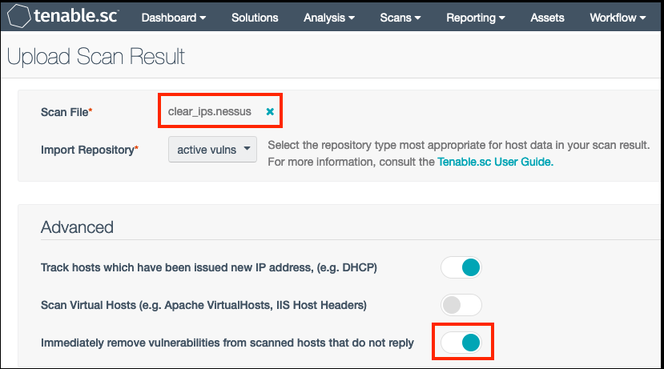

# tsc-cleaner

tsc-cleaner.py creates a .nessus file that can be uploaded to Tenable.SC to remove specified hosts.

Sometimes scans are launched that target unintended hosts which results in Tenable.SC storing vulnerability data for irrelevant hosts and unnecessary consumption of the license. In these scenarios, we can perform a manual scan upload to make Tenable.SC believe certain hosts are dead, therefore removing them from the cumulative vulnerability database and reclaiming the associated licenses. Tenable Support has provided a specially crafted .nessus file to customers for this purpose for a long time, but it requires editing the .nessus XML file directly which can be tedious and error prone. This script is merely a wrapper to make creation of the specially crafted .nessus file easier and less error prone.

## Requirements
* python3

## Installation
```
$ git clone https://github.com/andrewspearson/tsc-cleaner /usr/local/bin/tsc-cleaner
```
## Usage
View the help menu
```
$ python3 tsc-cleaner.py -h

usage: tsc-cleaner.py [-h] file

This script creates a .nessus file that will clear out IPs from Tenable.SC.

positional arguments:
  file        Text file with a list of IPs, IP ranges, or CIDRs to remove from
              Tenable.SC. One IP, range, or CIDR per line.

optional arguments:
  -h, --help  show this help message and exit
```
Create a file with a list of IPs, IP ranges, and/or CIDRs, such as this
```
$ cat ips.txt

10.0.0.1-10.0.0.254
172.16.0.0/24
192.168.0.1
192.168.0.3
192.168.0.5
```
Run the script
```
$ python3 tsc-cleaner.py ips.txt 

Created file clear_ips.nessus. Upload this file to Tenable.SC as a manual scan import to delete the specified IPs. The "Immediately remove vulnerabilities from scanned hosts that do not reply" option must be enabled. Use at your own risk. This action cannot be reversed.
```
Manually upload the clear_ips.nessus file to Tenable.SC



## Results
* Query Tenable.SC Vulnerability Analysis to determine if the expected IPs were cleared.
* Check Tenable.SC license usage to determine if the license usage decreased as expected.
